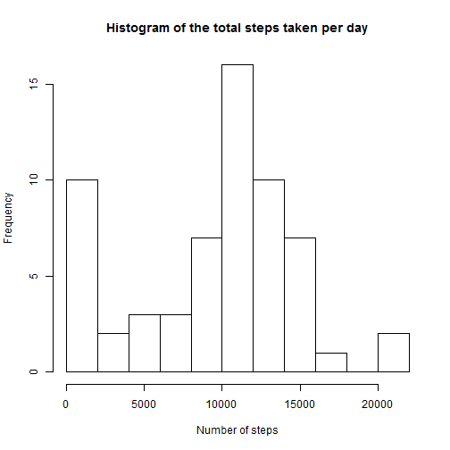
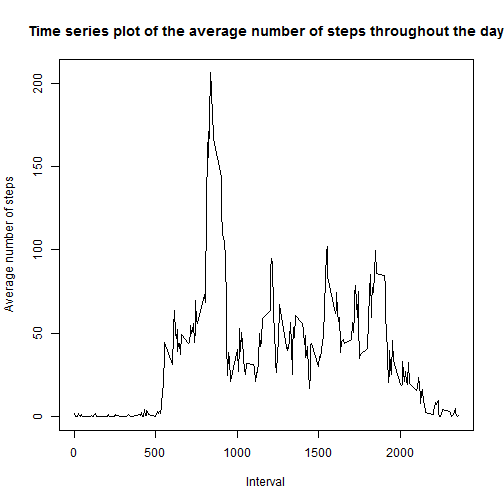
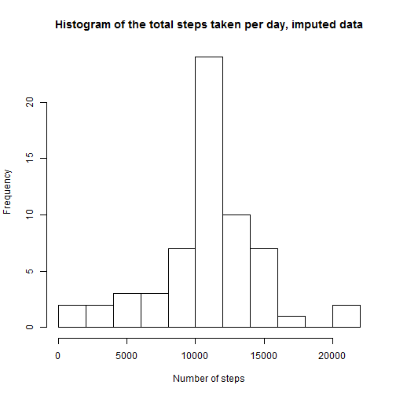
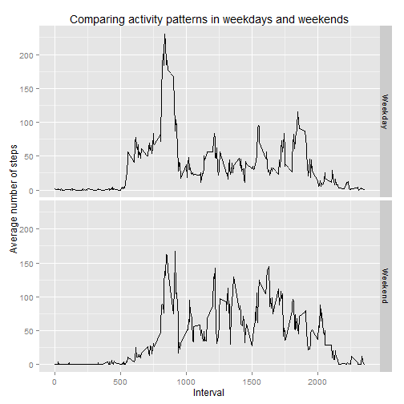

In this R Markdown document you can find my solution for the first peer assessed assignment of the Coursera "Reproducible Research"-course.

### Step 1 - loading and preprocessing the data

Loading the data into R (be aware that the data should be saved in your working directory in order for this code to work):


```r
activity <- read.csv("activity.csv",
                     header = TRUE)
```

Currently the date is saved in the factor format. I want to save it as a date (that's what it is). I'm doing this by first loading the lubridate package and then saving the date variable as a date. Prior to that I change the locale to the North American usage ("C"):


```r
Sys.setlocale("LC_ALL", "C")

suppressWarnings(library("lubridate"))

activity$date <- ymd(activity$date)
```

### Step 2 - What is the mean total number of steps taken per day?

The following command calculates the total number of steps per day. Missing values are ignored as told in the instructions.


```r
tapply(activity$steps,
       activity$date,
       FUN = sum,
       na.rm = TRUE)
```

```
## 2012-10-01 2012-10-02 2012-10-03 2012-10-04 2012-10-05 2012-10-06 
##          0        126      11352      12116      13294      15420 
## 2012-10-07 2012-10-08 2012-10-09 2012-10-10 2012-10-11 2012-10-12 
##      11015          0      12811       9900      10304      17382 
## 2012-10-13 2012-10-14 2012-10-15 2012-10-16 2012-10-17 2012-10-18 
##      12426      15098      10139      15084      13452      10056 
## 2012-10-19 2012-10-20 2012-10-21 2012-10-22 2012-10-23 2012-10-24 
##      11829      10395       8821      13460       8918       8355 
## 2012-10-25 2012-10-26 2012-10-27 2012-10-28 2012-10-29 2012-10-30 
##       2492       6778      10119      11458       5018       9819 
## 2012-10-31 2012-11-01 2012-11-02 2012-11-03 2012-11-04 2012-11-05 
##      15414          0      10600      10571          0      10439 
## 2012-11-06 2012-11-07 2012-11-08 2012-11-09 2012-11-10 2012-11-11 
##       8334      12883       3219          0          0      12608 
## 2012-11-12 2012-11-13 2012-11-14 2012-11-15 2012-11-16 2012-11-17 
##      10765       7336          0         41       5441      14339 
## 2012-11-18 2012-11-19 2012-11-20 2012-11-21 2012-11-22 2012-11-23 
##      15110       8841       4472      12787      20427      21194 
## 2012-11-24 2012-11-25 2012-11-26 2012-11-27 2012-11-28 2012-11-29 
##      14478      11834      11162      13646      10183       7047 
## 2012-11-30 
##          0
```

In order to generate a histogram of the total number of steps per day I save the total number of steps in a new variable called total_steps and plot a histogram of this new variable:


```r
total_steps <- tapply(activity$steps,
                      activity$date,
                      FUN = sum,
                      na.rm = TRUE)

hist(total_steps,
     main = "Histogram of the total steps taken per day",
     xlab = "Number of steps",
     breaks = 10)
```

 

Additionally you can calculate the mean and the median for the total number of steps taken per day:


```r
mean(total_steps)
```

```
## [1] 9354.23
```

```r
median(total_steps)
```

```
## [1] 10395
```

### Step 3 - What is the average daily activity pattern?

To analyse the daily activity pattern we first have to calculate the average number of steps per day in a given five minute interval and save these values in a new variable called ave_steps. Additionally we save the unique values of the interval variable in a second new variable called interv. Then we can plot these two variables in a time series plot:


```r
ave_steps <- tapply(activity$steps,
                    activity$interval,
                    FUN = mean,
                    na.rm = TRUE)

interv <- unique(activity$interval)

plot(interv, ave_steps,
     type = "l",
     main = "Time series plot of the average number of steps throughout the day",
     ylab = "Average number of steps",
     xlab = "Interval")
```

 

To detect which interval, on average across all the days in the dataset, contains the maximum number of steps we just have to find the maximum value of ave_steps. The respective intervals are saved as the dimnames:


```r
which.max(ave_steps) # the first returned value is the dimname, i. e. the interval (it's 835)
```

```
## 835 
## 104
```

### Step 4 - Imputing missing values

First we want to know the total number of missing values in our dataset. The table produced by the following command shows, that there are 2304 rows with missing values


```r
table(is.na(activity$steps))
```

```
## 
## FALSE  TRUE 
## 15264  2304
```

We now want to create a second dataset in which the missing values are imputed with the mean value for the respective interval across all days. Therefor we first save the dataset in a second object called activity2:


```r
activity2 <- activity
```

In a second step a function is defined that imputes missing values with the mean of the respective variable. Afterwards, using the plyr package, this function is applied to the activity2 dataset, precisely to the steps variable, but - thanks to ddply - separately for each interval group.


```r
imputation <- function(x) replace(x, is.na(x), mean(x, na.rm = TRUE))

suppressWarnings(library(plyr))
activity2 <- ddply(activity2, ~ interval,
                   transform, steps = imputation(steps))
```

In the third and final step we can plot a histogram of the imputed dataset and calculate mean and median for our imputed steps variable. As we can see comparing the means and medians of the NA-dataset and the imputed dataset the data changed through our imputation process: Mean and median value converged and are now the same value.


```r
total_steps2 <- tapply(activity2$steps,
                       activity2$date,
                       FUN = sum,
                       na.rm = TRUE)

hist(total_steps2,
     main = "Histogram of the total steps taken per day, imputed data",
     xlab = "Number of steps",
     breaks = 10)
```

 

```r
mean(total_steps)
```

```
## [1] 9354.23
```

```r
mean(total_steps2)
```

```
## [1] 10766.19
```

```r
median(total_steps)
```

```
## [1] 10395
```

```r
median(total_steps2)
```

```
## [1] 10766.19
```

### Step 5 - Are there differences in activity patterns between weekdays and weekends?

We first have to create a factor variable that indicates if the date belongs to a weekday or a weekend:


```r
activity2$day <- weekdays(activity2$date)

activity2$day[activity2$day == "Saturday" | activity2$day == "Sunday"] <- "Weekend"

activity2$day[activity2$day != "Weekend"] <- "Weekday"

activity2$day <- as.factor(activity2$day)
```

At last we want to create an panel plot containing a time series plot of the average number of steps per interval separately for weekdays and weekends.

First we calculate the average number of steps per interval separately for weekdays and weekends:


```r
suppressWarnings(library(dplyr))
```

```
## 
## Attaching package: 'dplyr'
## 
## Die folgenden Objekte sind maskiert from 'package:plyr':
## 
##     arrange, desc, failwith, id, mutate, summarise, summarize
## 
## Die folgenden Objekte sind maskiert from 'package:lubridate':
## 
##     intersect, setdiff, union
## 
## Die folgenden Objekte sind maskiert from 'package:stats':
## 
##     filter, lag
## 
## Die folgenden Objekte sind maskiert from 'package:base':
## 
##     intersect, setdiff, setequal, union
```

```r
activity3 <- group_by(activity2, interval, day)

activity3 <- summarise(activity3, mean(steps))

names(activity3)[3] = "mean_steps" # renaming the third column
```

Now we can use ggplot to create a panel plot, comparing the average number of steps per interval on weekdays and weekends via facets:


```r
suppressWarnings(library(ggplot2))

ggplot(activity3,
       aes(x = interval, y = mean_steps)) +
  geom_line() +
  facet_grid(day ~ .) +
  labs(title = "Comparing activity patterns in weekdays and weekends",
       x = "Interval",
       y = "Average number of steps")
```

 


